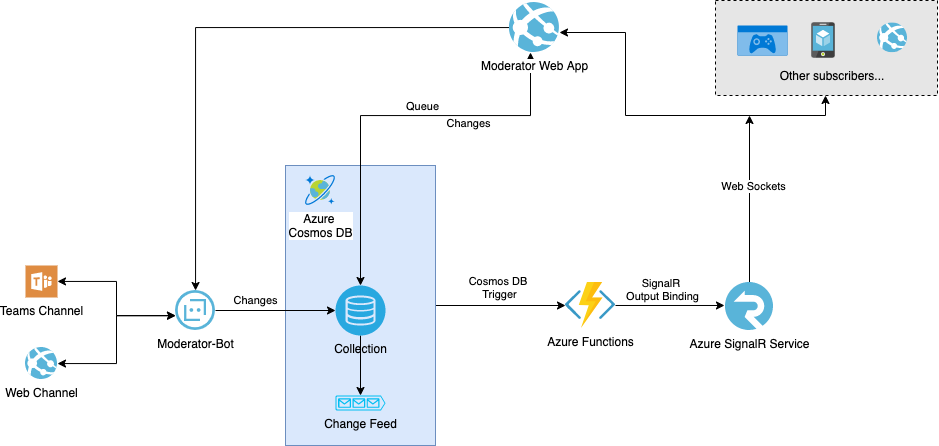

# Microsoft 365 and Graph Code Sample - Meeting Moderator Bot
Moderator bot helps manage the question queue in generated team channels. 

See [README](https://github.com/microsoftgraph/meeting-moderator-sample) in `master` branch for overview of the Moderator app.

## How to use
Simply mention the bot (@Moderator) in the breakout channels. Use keyword 'QQ' followed by your question.
An example: @Moderator QQ What is Microsoft Graph Toolkit?

## Behind the scenes
Moderator bot will add your question to a Cosmos DB collection based on Teams channel id. These collections are monitored by Azure Functions. When a new question is added or an existing question is updated, the corresponding function will be triggered and binding this action to a SignalR hub. SignalR hub then broadcast this signal to all the subscribers. Moderator app is one of the subscribers that gets notified. A list of questions will render on the Question Queue view real time. As the moderator announces the next question and clicks 'Answer' on the question list item, your question then gets marked as answered and removed from the view and marked as 'answered' in the collection.

## Architecture


## Resources
- [Teams conversation bot starter sample](https://github.com/microsoft/BotBuilder-Samples/tree/master/samples/javascript_nodejs/57.teams-conversation-bot)

## Setup bot locally
If you would like to test and modify bot code. Follow the steps in this section.

### Clone the project (project url subject to change)
```bash
git clone https://github.com/beth-panx/snowdragon-simplebot
cd snowdragon-simplebot
npm install
```

### Setup local env file
Add an `.env` file in the root dir. Add the following environment variables. These should also be added as app config once you are ready to deploy the bot. Or you can use a secret management resource such as [Key Vault](https://docs.microsoft.com/en-us/azure/key-vault/general/basic-concepts) to store sensitive information. 

```
MicrosoftAppId=
MicrosoftAppPassword=
COSMOS_ENDPOINT=
COSMOS_KEY=
COSMOS_DATABASEID=QuestionQueue
COSMOS_CONTAINERID=DemoContainer
```

### Register your web service with the bot framework
1. Register an AAD App with App Studio, or [this portal](https://dev.botframework.com/bots/new), or Azure Bot Channels Registration service. Follow the [instructions here](https://docs.microsoft.com/en-us/microsoftteams/platform/bots/how-to/create-a-bot-for-teams#register-your-web-service-with-the-bot-framework).
2. Update `MicrosoftAppId` and `MicrosoftAppPassword` in your .env file with Microsoft App Id and Secret you obtained from step 1.
3. When registering your web service, be sure to set the Display name to the same name you used for your Short name in your app manifest.

### Create your own Cosmos DB instance
1. There are many different ways. For initial configuration, use the Azure Portal and follow instrustions [here](https://docs.microsoft.com/en-us/azure/cosmos-db/create-cosmosdb-resources-portal).
2. Populate `COSMOS_ENDPOINT` and `COSMOS_KEY` in the .env file with `URI` and `PRIMARY KEY` in Cosmos DB Resource -> Settings -> Keys
3. Update Cosmos DB CORS settings to allow your ngrok url (use ngrok steps below) or localhost to access databases.
4. You can choose to use a different DatabaseId and ContainerId for the queue. You will need to also update this in your .env file to match names.
5. Alternatively, you can setup a local json file and access/update data locally.

### Start local server
Run `npm watch` to start `nodemon` and watch as file changes. Or simply run `npm start`.

### Use ngrok to securely sideload in Teams
Set up ngrok to tunnel port 3978 to your desired https address to be able to sideload/deploy app to Teams.
   ```
   ngrok http -host-header=rewrite 3978
   ```
### Upload the manifest package to your tenant
1. Create a tenant that you have permission to upload apps.
2. Update the manifest.json file with your `id`, `botId`, developer information, and command. If you attended the Microsoft 365 live show during Build 2020, you can follow the same steps in the show using App Studio to generate the manifest and Teams app zip.
### Test the bot
1. Upload the bot zip file to your tenant.
2. Add bot to chat or channel.
3. Simply mention the bot (@BOT_NAME) in the channel. Use keyword 'QQ' followed by your question. 
4. Go to your collection in Cosmos DB. You should see the message you just posted added as new item.

### Testing with Moderator app side by side with bot
1. Add a .env.development file to the root dir of moderator folder.
2. Add the following to this file. These are added to deployed resource as app config. Fun fact - you need `REACT_APP_` as a prefix to use dotenv in create-react-app.
```
REACT_APP_COSMOS_ENDPOINT=
REACT_APP_COSMOS_KEY=
REACT_APP_COSMOS_DATABASEID=QuestionQueue
REACT_APP_COSMOS_CONTAINERID=DemoContainer
REACT_APP_FUNCTIONS_BASEURL=
```
3. Create your own Azure functions and SignalR Hub (follow bonus steps below).
4. Make sure you build the project to generate environment vars that won't work at run-time. Start the project using `npm start`.
5. If your bot is running locally, you might have to tweak the CORS rules JFYI.
6. You can watch and see if signalr hub is connected by using the console. Minor logs are included.

## Bonus
You can deploy all the resources yourself to have an end to end experience if you really want to sleep a little less. Watch out for the app config variables you need to add to these resources. Also pay attention to CORS rules.
### Create your own Azure functions and SignalR Hub
- [Azure Functions](https://github.com/beth-panx/snowdragon-functions). These are the functions that watches the Cosmos DB and gets triggered by an upsert event. It also binds to SignalR Hub.
- [SignalR](https://docs.microsoft.com/en-us/azure/azure-signalr/). You can configure this as serverless in Azure Portal.
### Try out outgoing webhook instead of a bot
- [Simple Webhook](https://github.com/beth-panx/snowdragon-simplewebhook). This is a dumb service that acts like app but can be deployed to any Teams as an outgoing webhook. You'd need to keep track of the security token for each team.

